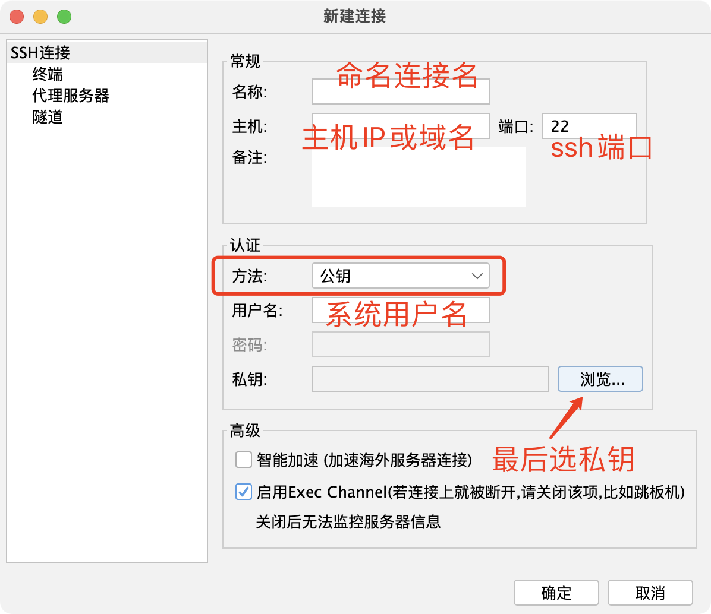
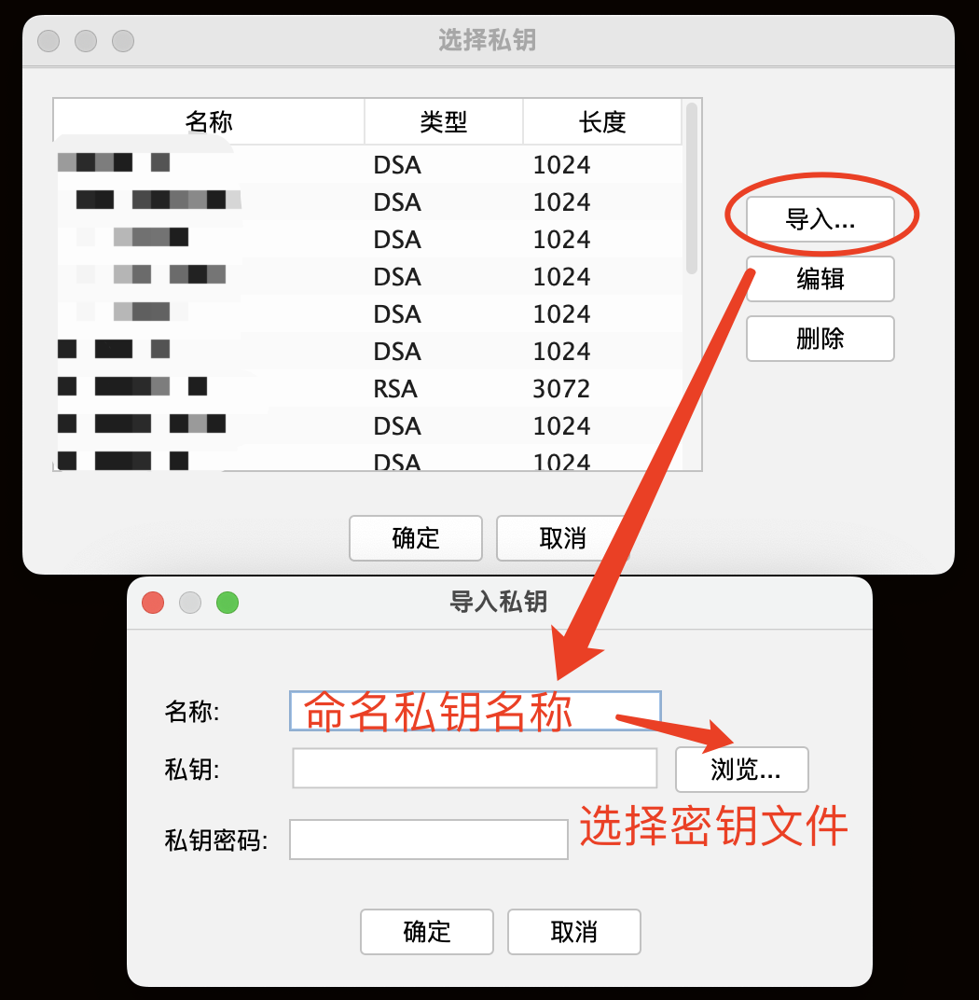

# ABHPC集群使用和管理教程

遵循一般Linux系统的规则，**凡命令行开头为"#"的，表明此时正在使用root账户，而命令行开头为"$"的，则表明此时在使用普通用户**。

建议没有Linux系统使用经验的用户，首先阅读[Linux常用命令](User/Linux常用命令.md)。

本教程中，部分命令是ABHPC特有的脚本命令，在此不再详细说明。

本项目针对普通用户和管理员提供以下教程：

## 目录

* [1.普通用户](#1%E6%99%AE%E9%80%9A%E7%94%A8%E6%88%B7)
  + [1.1 使用ssh客户端连接集群](#11-%E4%BD%BF%E7%94%A8ssh%E5%AE%A2%E6%88%B7%E7%AB%AF%E8%BF%9E%E6%8E%A5%E9%9B%86%E7%BE%A4)
    - [1.1.1 MobaXterm设置ssh登录ABHPC系统](#111-mobaxterm%E8%AE%BE%E7%BD%AEssh%E7%99%BB%E5%BD%95abhpc%E7%B3%BB%E7%BB%9F)
    - [1.1.2 FinalShell设置ssh登录ABHPC系统](#112-finalshell%E8%AE%BE%E7%BD%AEssh%E7%99%BB%E5%BD%95abhpc%E7%B3%BB%E7%BB%9F)
  + [1.2 使用Nomachine连接图形界面](#12-%E4%BD%BF%E7%94%A8nomachine%E8%BF%9E%E6%8E%A5%E5%9B%BE%E5%BD%A2%E7%95%8C%E9%9D%A2)
  + [1.3 用户计算作业管理基本操作](#13-%E7%94%A8%E6%88%B7%E8%AE%A1%E7%AE%97%E4%BD%9C%E4%B8%9A%E7%AE%A1%E7%90%86%E5%9F%BA%E6%9C%AC%E6%93%8D%E4%BD%9C)
    - [1.3.1 提交作业](#131-%E6%8F%90%E4%BA%A4%E4%BD%9C%E4%B8%9A)
    - [1.3.2 查看作业](#132-%E6%9F%A5%E7%9C%8B%E4%BD%9C%E4%B8%9A)
    - [1.3.3 中断作业](#133-%E4%B8%AD%E6%96%AD%E4%BD%9C%E4%B8%9A)
    - [1.3.4 查看节点情况](#134-%E6%9F%A5%E7%9C%8B%E8%8A%82%E7%82%B9%E6%83%85%E5%86%B5)
    - [1.3.5 查看队列(Partition)状态](#135-%E6%9F%A5%E7%9C%8B%E9%98%9F%E5%88%97partition%E7%8A%B6%E6%80%81)
    - [1.3.6 历史作业信息与统计](#136-%E5%8E%86%E5%8F%B2%E4%BD%9C%E4%B8%9A%E4%BF%A1%E6%81%AF%E4%B8%8E%E7%BB%9F%E8%AE%A1)
  + [1.4 进阶：并行计算基础知识](#14-%E8%BF%9B%E9%98%B6%E5%B9%B6%E8%A1%8C%E8%AE%A1%E7%AE%97%E5%9F%BA%E7%A1%80%E7%9F%A5%E8%AF%86)
  + [1.5 常见错误](#15-%E5%B8%B8%E8%A7%81%E9%94%99%E8%AF%AF)
    - [1.5.1 error: Unable to allocate resources: Invalid account or account/partition combination specified](#151-error-unable-to-allocate-resources-invalid-account-or-accountpartition-combination-specified)
* [2.集群管理员](#2%E9%9B%86%E7%BE%A4%E7%AE%A1%E7%90%86%E5%91%98)
  + [2.1 新建集群用户](#21-%E6%96%B0%E5%BB%BA%E9%9B%86%E7%BE%A4%E7%94%A8%E6%88%B7)
    - [2.1.1 新建Linux系统用户](#211-%E6%96%B0%E5%BB%BAlinux%E7%B3%BB%E7%BB%9F%E7%94%A8%E6%88%B7)
    - [2.1.2 将新建用户信息广播](#212-%E5%B0%86%E6%96%B0%E5%BB%BA%E7%94%A8%E6%88%B7%E4%BF%A1%E6%81%AF%E5%B9%BF%E6%92%AD)
    - [2.1.3 添加用户到集群许可账户](#213-%E6%B7%BB%E5%8A%A0%E7%94%A8%E6%88%B7%E5%88%B0%E9%9B%86%E7%BE%A4%E8%AE%B8%E5%8F%AF%E8%B4%A6%E6%88%B7)
    - [2.1.4 用户初始化](#214-%E7%94%A8%E6%88%B7%E5%88%9D%E5%A7%8B%E5%8C%96)
  + [2.2 Slurm系统管理](#22-slurm%E7%B3%BB%E7%BB%9F%E7%AE%A1%E7%90%86)
    - [2.2.1 查看关联关系](#221-%E6%9F%A5%E7%9C%8B%E5%85%B3%E8%81%94%E5%85%B3%E7%B3%BB)
    - [2.2.2 管理Account和User](#222-%E7%AE%A1%E7%90%86account%E5%92%8Cuser)
    - [2.2.3 Account和User的权限管理](#223-account%E5%92%8Cuser%E7%9A%84%E6%9D%83%E9%99%90%E7%AE%A1%E7%90%86)
    - [2.2.4 管理员计费系统](#224-%E7%AE%A1%E7%90%86%E5%91%98%E8%AE%A1%E8%B4%B9%E7%B3%BB%E7%BB%9F)
  + [2.3 常用软件的安装和注意事项](#23-%E5%B8%B8%E7%94%A8%E8%BD%AF%E4%BB%B6%E7%9A%84%E5%AE%89%E8%A3%85%E5%92%8C%E6%B3%A8%E6%84%8F%E4%BA%8B%E9%A1%B9)
    - [2.3.1 Gaussian 2016安装注意事项](#231-gaussian-2016%E5%AE%89%E8%A3%85%E6%B3%A8%E6%84%8F%E4%BA%8B%E9%A1%B9)

## 1.普通用户

### 1.1 使用ssh客户端连接集群

推荐使用以下ssh客户端。

Windows系统：[MobaXterm](https://mobaxterm.mobatek.net)

MacOS系统：[FinalShell](https://www.hostbuf.com) (**付费软件，但是很便宜**)

ABHPC使用DSA登录系统，用户私钥由管理员提供（管理员参考[2.1 新建集群用户](#21-%E6%96%B0%E5%BB%BA%E9%9B%86%E7%BE%A4%E7%94%A8%E6%88%B7)）。

用户收到密钥后，可将密钥保存到安全的位置，一般命名为```username@host.id_dsa```，以防止多密钥时弄混。

#### 1.1.1 MobaXterm设置ssh登录ABHPC系统

MobaXterm新建ssh连接后，按照下图设置主机IP（或域名）、用户名、ssh端口号、最后选择导入私钥文件。在Bookmark Settings标签页可以设置连接的名称：

<div  align="center">    

</div>

#### 1.1.2 FinalShell设置ssh登录ABHPC系统

首先，新建一个ssh连接，按照下图所示顺序设置好连接名、主机IP（或域名）、ssh端口号。认证方式为“公钥”，并输入用户名。最后选择浏览，选择私钥文件。

<div  align="center">    

</div>

导入私钥文件：

<div  align="center">    

</div>


### 1.2 使用Nomachine连接图形界面

### 1.3 用户计算作业管理基本操作

abhpc 使用Slurm系统进行计算作业管理。用户不必关注每个节点的情况，只需要告诉系统自己要运行什么程序、使用多少计算资源，Slurm系统即可自动对作业进行排队管理。以下是普通用户的常用操作介绍。

#### 1.3.1 提交作业

```
$ sbatch [作业脚本].slm
```
常用的slurm脚本可以在[这里下载](常用slurm脚本)。

#### 1.3.2 查看作业
```
$ squeue
```
通过此命令可以获得作业的信息如ID和运行状态等。

#### 1.3.3 中断作业
```
$ scancel [作业ID]
```
中断本用户的全部作业
```
$ scancel -u $USER
```

#### 1.3.4 查看节点情况

以测试集群为例，使用```slhosts```命令可以查看集群全部计算节点的状态。

```
$ slhosts
HOSTNAME STATE      CPUS    CPUS(A/I/O/T) FREE_MEM   REASON GRES
C01      idle       20          0/20/0/20    52609     none gpu:rtx2080:2
C02      idle       20          0/20/0/20    53734     none gpu:rtx2080:2
C03      idle       20          0/20/0/20    53692     none gpu:rtx2080:2
C04      idle       20          0/20/0/20    53740     none gpu:rtx2080:2
```
其中，CPUS(A/I/O/T)分别代表CPU的Allocated/Idle/Other/Total个数。这样可以判断哪些节点是可用
的，最大能提交多少核、多少节点。

#### 1.3.5 查看队列(Partition)状态

ABHPC默认在环境变量中设置```sinfo```命令的输出格式为：
```
export SINFO_FORMAT="%10P %.6a %.6D  %.4c  %8t %16G %N"
```
其输出格式为：
```
# sinfo
PARTITION   AVAIL  NODES  CPUS  STATE    GRES             NODELIST
MX*            up      8    48  down*    (null)           A[13-20]
MX*            up     11    48  idle     (null)           A[02-12]
MXQS           up      1    48  idle     (null)           A01
```
这样可以显示多少节点可用，每个节点多少核数。用户直接使用```sinfo```命令可满足大部分场景，如果有特殊需求的，请在$HOME/.bashrc文件中自定义环境变量SINFO_FORMAT。


#### 1.3.6 历史作业信息与统计

ABHPC提供额外的命令```slhist```以显示历史作业，默认是显示当日的作业信息，例如：
```
$ slhist
 JobID    JobName         NodeList      User        Elapsed      State                                                      WorkDir
------ ---------- ---------------- --------- -------------- ----------        -----------------------------------------------------
     6       test    None assigned       liq       00:00:00 CANCELLED+                                               /home/liq/text
     7       test    None assigned       liq       00:00:00 CANCELLED+                                               /home/liq/text
     9       test              A01       liq       01:13:03 CANCELLED+                                               /home/liq/text
    10       test              A02       liq       00:43:00 CANCELLED+                                           /home/liq/text2/64
    11       test         A[01,03]       liq       00:42:30 CANCELLED+                                         /home/liq/text2/3232
    12       test              A01       liq       00:08:36 COMPLETED                                            /home/liq/text/scf
    13       test              A02       liq       00:05:34 COMPLETED                                        /home/liq/text2/64/scf
    14       test         A[01,03]       liq       00:10:47 COMPLETED                                      /home/liq/text2/3232/scf
    15       test              A01       liq       00:02:45 CANCELLED+                                               /home/liq/text
    16       test              A02       liq       00:26:16 RUNNING                                              /home/liq/text2/64
    17       test         A[01,03]       liq       00:24:27 RUNNING                                            /home/liq/text2/3232
```
第一列JobID是作业ID，第二列JobName是作业名，第三列Nodelist是运行的计算节点列表，第四列User是用户名，第五列Elapsed是运行时间，第六列State是作业状态，最后一列WorkDir是作业运行的目录。

也可以通过```-S  [开始时间]```和```-E   [结束时间]```参数来查看指定时间范围内的作业情况。

Slurm的时间格式为：[YYYY]-[MM]-[DD]T[hh]:[mm]:[ss]，如2019年1月1日0时0分0秒的格式写作：
```
2019-01-01T00:00:00
```
查看用户自2019年1月1日至今的作业情况，可用以下命令查看：
```
$ slhist -S 2019-01-01
 JobID    JobName         NodeList      User        Elapsed      State                                                      WorkDir
------ ---------- ---------------- --------- -------------- ----------        -----------------------------------------------------
     4       test    None assigned       liq       00:00:00 CANCELLED+                                               /home/liq/text
     5       test    None assigned       liq       00:00:00 CANCELLED+                                               /home/liq/text
     6       test    None assigned       liq       00:00:00 CANCELLED+                                               /home/liq/text
     7       test    None assigned       liq       00:00:00 CANCELLED+                                               /home/liq/text
     9       test              A01       liq       01:13:03 CANCELLED+                                               /home/liq/text
    10       test              A02       liq       00:43:00 CANCELLED+                                           /home/liq/text2/64
    11       test         A[01,03]       liq       00:42:30 CANCELLED+                                         /home/liq/text2/3232
    12       test              A01       liq       00:08:36 COMPLETED                                            /home/liq/text/scf
    13       test              A02       liq       00:05:34 COMPLETED                                        /home/liq/text2/64/scf
    14       test         A[01,03]       liq       00:10:47 COMPLETED                                      /home/liq/text2/3232/scf
    15       test              A01       liq       00:02:45 CANCELLED+                                               /home/liq/text
    16       test              A02       liq       00:32:45 RUNNING                                              /home/liq/text2/64
    17       test         A[01,03]       liq       00:30:56 RUNNING                                            /home/liq/text2/3232
```

统计用户机时用```sreport```命令，例如统计2019-01-01至2023-07-31这段时间内，liq用户的机时：
```
$ sreport cluster AccountUtilizationByUser start=2019-01-01 end=2023-07-31 user=liq
--------------------------------------------------------------------------------
Cluster/Account/User Utilization 2019-01-01T00:00:00 - 2023-07-30T14:59:59 (144428400 secs)
Usage reported in CPU Minutes
--------------------------------------------------------------------------------
  Cluster         Account     Login     Proper Name     Used   Energy
--------- --------------- --------- --------------- -------- --------
    abhpc             root       liq                    15705        0
```
注意这里的机时是按分钟数计算的，实际算机时还要除以60。


### 1.4 进阶：并行计算基础知识

问题：核用得越多，我的计算速度越快吗？

**回答**：不一定。首先要弄清楚并行计算的基本原理：所谓并行计算，就是把一个计算任务分割成几部分，交给不同的计算单元去计算。

以LAMMPS为例，每计算一个时间步长，各核之间就要通信一次，以交换各核之间的边界原子的信息。那么在一个计算周期中的计算时间分为2部分：

$$T_{\rm tot} = T_{\rm cal} + T_{\rm com} $$

其中 $T_{\rm tot}$ 是计算所需总时间， $T_{\rm cal}$ 是单核完成计算的时间， $T_{\rm com}$ 是各核完成计算后的同步时间。

如下图所示，核数越多，各计算核心分配到的计算任务（原子数）越少，那么 $T_{\rm cal}$ 就会相应降低；另一方面，核与核之间的边界原子会随着核数的增加呈几何级数增加，通信时间也就会不断增加， $T_{\rm com}$ 会急剧增大。因此，增加计算核数的后果是， $T_{\rm cal}$ 减小， $T_{\rm com}$ 增大，总计算时间 $T_{\rm tot} = T_{\rm cal} + T_{\rm com}$ 不一定减小。只有当 $T_{\rm cal}$ 减小的部分大于 $T_{\rm com}$ 增大的部分，这样的计算才是加速的，否则计算反而会变慢。

为了减小 $T_{\rm com}$ ，建设集群需要花费大量资金购买Infiniband交换机，这是为了尽可能地降低通信的延迟，从而降低通信时间。

所以，并不是核数用得越多，计算速度越快，当核数多到一定程度的时候，计算速度反而有所下降，甚至还会引起其他的问题，比如计算卡死。

<div  align="center">    

</div>


### 1.5 常见错误

#### 1.5.1 error: Unable to allocate resources: Invalid account or account/partition combination specified

管理员创建用户时，未将该用户添加到任何Account中，使得该用户无法使用计算资源。请联系管理员，让管理员参考[2.2 Slurm系统管理](#22-slurm%E7%B3%BB%E7%BB%9F%E7%AE%A1%E7%90%86)进行设置。


[ssh远程连接集群](User/ssh远程连接集群.md)

[远程桌面连接集群](User/使用x2go连接Ubuntu远程桌面.md)

[Slurm用户教程](User/Slurm用户教程.md)


## 2.集群管理员

### 2.1 新建集群用户

以下案例在集群上创建一个名为"james"的用户, 注意最好一个人建一个用户，同课题组的用户可以创建一个账号，在abhpc 系统中规定账号只能英文和数字，且不能以数字开头。

建议用户名使用人名缩写：张三——"zhangs"，李四——"lis"，以方便管理。

**以下以"#"开头的命令行表示是root用户执行的命令，"$"开头表示的是普通用户执行的命令。**

#### 2.1.1 新建Linux系统用户

创建用户(这里不必指定密码)
```
# useradd james -d [home目录，例如:/home-fs/james]
```
若ssh只允许用私钥登录（安全起见），则无需给用户添加密码。添加密码的方法如下(非必要)：
```
# passwd james
```
回车后输入密码即可，注意Linux下输入密码不会有任何显示（Windows下输入密码可能显示为"********"）。

#### 2.1.2 将新建用户信息广播

注意这里是大写字母"C":
```
# make -C /var/yp
make: Entering directory '/var/yp'
make[1]: Entering directory '/var/yp/abhpc -ai'
Updating shadow.byname...
Updating passwd.byname...
Updating passwd.byuid...
Updating group.byname...
Updating group.bygid...
Updating netid.byname...
make[1]: Leaving directory '/var/yp/abhpc -ai'
make: Leaving directory '/var/yp'
```

#### 2.1.3 添加用户到集群许可账户

一般同一个课题组的用户都设置一个组（在Slurm中叫做Account），查看Account和用户的命令为：
```
# slassoc
   Cluster    Account       User                  QOS  Partition                        GrpTRES
---------- ---------- ---------- -------------------- ---------- ------------------------------
    abhpc        root                          normal                                           
    abhpc        root       root               normal                                           
    abhpc         crx                          normal                                           
    abhpc         crx     xinghb               normal                                           
    abhpc         crx    zhangyl               normal                                           
    abhpc       shock                          normal                                           
    abhpc       shock       haiy               normal                                           
    abhpc       shock        dli               normal                                           
    abhpc       shock      guajy               normal                                           
    abhpc       shock       tusc               normal                                           
    abhpc       shock       xijx               normal                                           
    abhpc         tcm                          normal                                           
    abhpc         tcm      huaxy               normal                                           
    abhpc         tcm     huangs               normal                                           
    abhpc         xrd                          normal                                           
    abhpc         xrd       ches               normal                                           
    abhpc         xrd     hengyt               normal                                           
```
该命令可以显示集群中的全部组、用户和权限。关于Account和User的关系，更详细的管理教程参考[2.2 Slurm系统管理](#22-slurm%E7%B3%BB%E7%BB%9F%E7%AE%A1%E7%90%86)。

把james加入到名为tensorflow的Account下。
```
# sacctmgr add user james Account=tensorflow
Adding User(s)
james
Associations =
U = james     A = tensorflow C = abhpc -ai  
Non Default Settings
Would you like to commit changes? (You have 30 seconds to decide)
(N/y): y
```

#### 2.1.4 用户初始化

ABHPC系统通过命令```init-dsa.sh```对用户进行初始化。还是以james用户为例，首先切换到james用户，然后执行命令，一路回车即可：
```
# su james
$ cd
$ init-dsa.sh
Generating public/private rsa key pair.
Enter file in which to save the key (/home/james/.ssh/id_rsa):
Created directory '/home/james/.ssh'.
Enter passphrase (empty for no passphrase):
Enter same passphrase again:
Your identification has been saved in /home/james/.ssh/id_rsa.
Your public key has been saved in /home/james/.ssh/id_rsa.pub.
The key fingerprint is:
SHA256:SmnuUoInulf4ecwfNWn79wxdRoaL6wMb4Ki85Jfoddc james@abhpc -ai
The key's randomart image is:
+---[RSA 2048]----+
|                 |
|               . |
|              . o|
|       ..  . . + |
|   o  +oS.= . . o|
|  + ++o..oo+ . o.|
| . *.O+.o o+E . .|
|. .oBo*. o.o. .o |
|.o .+=...   oo .o|
+----[SHA256]-----+
```
执行结束后，在james用户的$HOME/.ssh/目录下有一个id_dsa文件，需要下载下来作为ssh登录的DSA密钥。

### 2.2 Slurm系统管理

在进行管理之前，必须知道Slurm调度系统分为两个基本层面：Account（账户）和User（用户）。基于这两个基本层面，Slurm形成了“关联”(Assoc)。

Account类似于group的概念，是由多个User（用户）组成，在大集群上可以用来统一计算用户组的机时，通过对Account设置，可以对该用户组的全部用户进行条件约束。例如：在集群上需要限制某个用户组的使用总核数，则可以将这些用户放置在一个Account下，设置其可用的CPU总数、GRES等资源的限制。

User则落实到具体的某个用户，除了可以在Account上对全体用户进行限制外，还可以单独限制某个用户的最大资源。

#### 2.2.1 查看关联关系

Slurm系统默认使用```sacctmgr```命令查看关联关系：
```
# sacctmgr list assoc
Cluster    Account       User  Partition     Share GrpJobs       GrpTRES GrpSubmit     GrpWall   GrpTRESMins MaxJobs       MaxTRES MaxTRESPerNode MaxSubmit     MaxWall   MaxTRESMins             QOS   Def QOS GrpTRESRunMin
---------- ---------- ---------- ---------- --------- ------- ------------- --------- ----------- ------------- ------- ------------- -------------- --------- ----------- ------------- -------------------- --------- -------------
abhpc-ai       root                               1                                                                                                                                                  normal                         
abhpc-ai       root       root                    1                                                                                                                                                  normal                         
abhpc-ai tensorflow                               1                                                                                                                                                  normal                         
abhpc-ai tensorflow      abhpc                    1                                                                                                                                                  normal                         
abhpc-ai tensorflow       lily                    1                                                                                                                                                  normal                         
```
全部显示关联未免过于凌乱。在ABHPC系统重，可使用以下命令简洁地输出关联信息：
```
# slassoc
  Cluster    Account       User                  QOS  Partition       GrpTRES
---------- ---------- ---------- -------------------- ---------- -------------
  abhpc-ai       root                          normal                          
  abhpc-ai       root       root               normal                          
  abhpc-ai tensorflow                          normal                          
  abhpc-ai tensorflow      abhpc               normal                          
  abhpc-ai tensorflow       lily               normal
```

#### 2.2.2 管理Account和User

通过以下命令可以查看到Account管理的参数：
```
# sacctmgr --help
......
add account        - Clusters=, DefaultQOS=, Description=, Fairshare=,
                     GrpTRESMins=, GrpTRES=, GrpJobs=, GrpMemory=,   
                     GrpNodes=, GrpSubmitJob=, GrpWall=, MaxTRESMins=,
                     MaxTRES=, MaxJobs=, MaxNodes=, MaxSubmitJobs=,
                     MaxWall=, Names=, Organization=, Parent=,      
                     and QosLevel=                                  
modify account     - (set options) DefaultQOS=, Description=,       
                     Fairshare=, GrpTRESMins=, GrpTRESRunMins=,       
                     GrpTRES=, GrpJobs=, GrpMemory=, GrpNodes=,     
                     GrpSubmitJob=, GrpWall=, MaxTRESMins=, MaxTRES=,
                     MaxJobs=, MaxNodes=, MaxSubmitJobs=, MaxWall=,
                     Names=, Organization=, Parent=, and QosLevel=  
                     RawUsage= (with admin privileges only)         
                     (where options) Clusters=, DefaultQOS=,        
                     Descriptions=, Names=, Organizations=,         
                     Parent=, and QosLevel=
......
```

也可以查看到add user部分的参数：
```
# sacctmgr --help
......
add user           - Accounts=, AdminLevel=, Clusters=,             
                     DefaultAccount=, DefaultQOS=, DefaultWCKey=,   
                     Fairshare=, MaxTRESMins=, MaxTRES=,            
                     MaxJobs=, MaxNodes=, MaxSubmitJobs=, MaxWall=,
                     Names=, Partitions=, and QosLevel=             
modify user        - (set options) AdminLevel=, DefaultAccount=,    
                     DefaultQOS=, DefaultWCKey=, Fairshare=,        
                     MaxTRESMins=, MaxTRES=, MaxJobs=, MaxNodes=,   
                     MaxSubmitJobs=, MaxWall=, NewName=,            
                     and QosLevel=,                                 
                     RawUsage= (with admin privileges only)         
                     (where options) Accounts=, AdminLevel=,        
                     Clusters=, DefaultAccount=, Names=,            
                     Partitions=, and QosLevel=
......
```
**新建一个account的命令如下：**
```
# sacctmgr add account [账号名称]
```
**添加用户到指定的Account（例如tensorflow）：**
```
# sacctmgr add user account=tensorflow
```
**修改用户属性**
```
# sacctmgr modify user [用户名] set [属性]=[设定值]
```
用户的属性值可以查阅[帮助文档](https://slurm.schedmd.com/sacctmgr.html)。

#### 2.2.3 Account和User的权限管理

Account和User的权限使用GrpTRES来进行限制：
```
GrpTRES=<TRES=max TRES,...>  
Maximum number of TRES running jobs are able to be allocated in aggregate for this association and all associations which are children of this association. To clear a previously set value use the modify command with a new value of -1 for each TRES id.  
NOTE: This limit only applies fully when using the Select Consumable Resource plugin.
```
例如，限制lily用户的CPU核数为40，节点数为2，GPU最大使用为4：
```
# sacctmgr modify user lily set Grptres="cpu=40,node=2,gres/gpu=4"
# slassoc
   Cluster    Account       User                  QOS  Partition                        GrpTRES
---------- ---------- ---------- -------------------- ---------- ------------------------------
  abhpc-ai       root                          normal
  abhpc-ai       root       root               normal
  abhpc-ai tensorflow                          normal
  abhpc-ai tensorflow      abhpc               normal
  abhpc-ai tensorflow       lily               normal                  cpu=40,gres/gpu=4,node=2
```

重置该用户全部限制则为：
```
# sacctmgr modify user lily set Grptres="cpu=-1,node=-1,gres/gpu=-1"
   Cluster    Account       User                  QOS  Partition                        GrpTRES
---------- ---------- ---------- -------------------- ---------- ------------------------------
  abhpc-ai       root                          normal
  abhpc-ai       root       root               normal
  abhpc-ai tensorflow                          normal
  abhpc-ai tensorflow      abhpc               normal
  abhpc-ai tensorflow       lily               normal                  
```
同样，可以对整个Account进行限制，其含义是Account包含的全部用户累计总和不得超过最大限制。例如：
```
# sacctmgr modify account tensorflow set Grptres="cpu=40,node=2,gres/gpu=4"
# slassoc
   Cluster    Account       User                  QOS  Partition                        GrpTRES
---------- ---------- ---------- -------------------- ---------- ------------------------------
  abhpc-ai       root                          normal                                           
  abhpc-ai       root       root               normal                                           
  abhpc-ai tensorflow                          normal                  cpu=40,gres/gpu=4,node=2
  abhpc-ai tensorflow      abhpc               normal                                           
  abhpc-ai tensorflow       lily               normal
```
重置该Account的全部限制为：
```
# sacctmgr modify account tensorflow set Grptres="cpu=-1,node=-1,gres/gpu=-1"
   Cluster    Account       User                  QOS  Partition                        GrpTRES
---------- ---------- ---------- -------------------- ---------- ------------------------------
  abhpc-ai       root                          normal
  abhpc-ai       root       root               normal
  abhpc-ai tensorflow                          normal
  abhpc-ai tensorflow      abhpc               normal
  abhpc-ai tensorflow       lily               normal
```

#### 2.2.4 管理员计费系统

如果集群涉及到计费问题，则需要统计用户(User)或账户(Account)在某段时间内的使用机时，在[1.3.6 历史作业信息与统计](#136-%E5%8E%86%E5%8F%B2%E4%BD%9C%E4%B8%9A%E4%BF%A1%E6%81%AF%E4%B8%8E%E7%BB%9F%E8%AE%A1)中已经提供了用户机时的统计方法，但同一Account下的其他用户的作业是互相不可见的，因此，作为管理员可以对单个用户计费，也可以对整个Account进行机时计费，以下举例说明。

**对用户lily自2019年1月1日0时起使用的机时进行统计：**
```
# sreport cluster AccountUtilizationByUser start=2019-01-01 user=lily
```
注意这种统计一般当日的机时是不计算在内的，如有需求，通过参数```end=[截止日期]```手动执行时间范围。

**管理员也可对整个组（Account）进行机时统计：**
```
# sreport cluster AccountUtilizationByAccount start=2019-01-01 account=cmt
--------------------------------------------------------------------------------
Cluster/Account/User Utilization 2019-01-01T00:00:00 - 2023-07-29T23:59:59 (144374400 secs)
Usage reported in CPU Minutes
--------------------------------------------------------------------------------
  Cluster         Account     Login     Proper Name       Used   Energy
--------- --------------- --------- --------------- ---------- --------
    abhpc             cmt                            108891822        0
    abhpc             cmt       yib                     246829        0
    abhpc             cmt     guxiy                    4396837        0
    abhpc             cmt      guyf                   13610509        0
    abhpc             cmt    huangs                   90637647        0
```


### 2.3 常用软件的安装和注意事项

#### 2.3.1 Gaussian 2016安装注意事项

安装好以后，需要将g16目录属权归属给某一个group，例如归属给g16：
```
chown -Rf root:g16 g16/
```

然后修改用户到相应的group，例如：修改james用户到g16用户组。
```
# usermod -g g16 james
```
以上操作即可将james列入g16用户组。
