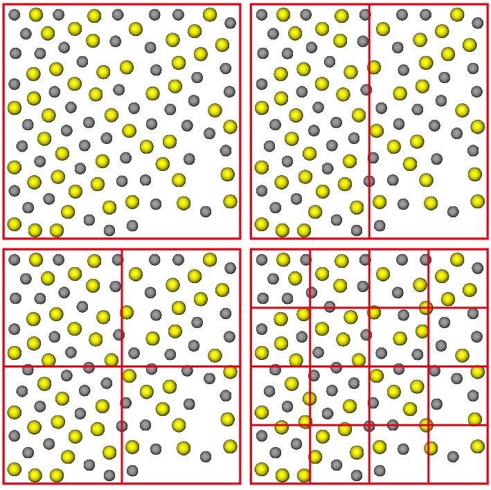

### 并行计算的误区与常见错误
#### 1.核用得越多，计算速度越快？
回答：不一定。首先要弄清楚并行计算的基本原理：所谓并行计算，就是把一个计算任务分割成几部分，交给不同的计算单元去计算。但对于LAMMPS而言，每计算一个时间步长，各核之间就要通信一次，以交换各核之间的边界原子的信息。那么在一个计算周期(1时间步长)中的计算时间分为2部分：计算时间和通信时间。如下图所示，核数越多，各计算核心分配到的计算任务（原子数）越少，那么一个周期内的计算时间就会相应降低，但另一方面，核与核之间的边界原子会随着核数的增加呈几何级数增加，通信时间也就会不断增加。这就是为什么实验室要花费十几万购买IB交换机的原因，只是为了尽可能地降低通信的延迟，从而降低通信时间。所以，并不是核数用得越多，计算速度越快，当核数多到一定程度的时候，计算速度反而有所下降，甚至还会引起其他的问题，比如说计算卡死。

    

